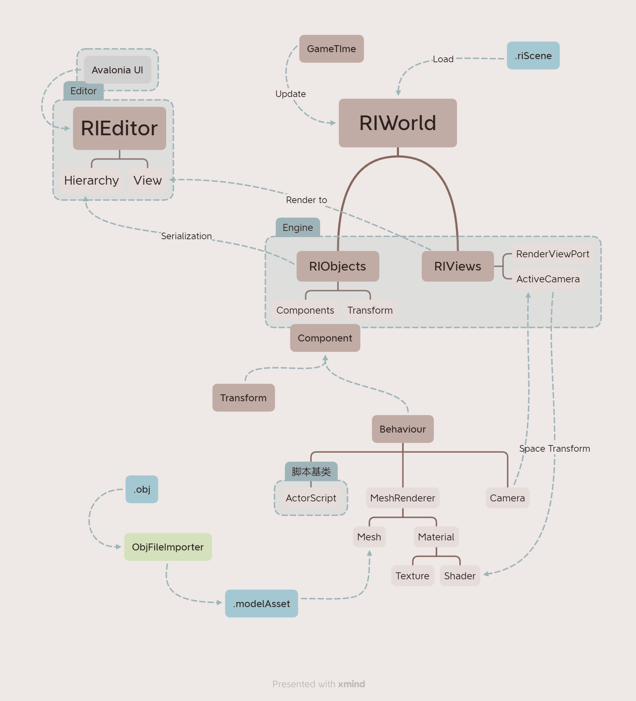

# Red Iron Engine

## Inspired by Unity, a fully C# 3D Engine
Most 3d engines are written in C++ in order to get best performance,
but I choose to use C# because it's a language that I know well and I like it.

Considering this project is a personal learning project, I don't need to get the best performance.
Maybe some years later, I will rewrite it in C++.

The engine architecture is inspired by Unity, but it's not a clone of Unity. As fully wrote
in C#, this project doesn't need to handle problems like sharing objects between C# and C++,
which makes it easier and makes the architecture more clear.

## Features
- Cross-platform: Windows, Linux, MacOS
- Basic 3D rendering
- Basic Scripting
- Basic Editor: Scene view, Game view, Inspector, Hierarchy

## Packages Used
- OpenTK: OpenGL wrapper for C#
- Avalonia UI: Cross-platform UI framework, used for building the basic editor UI.
- Newtonsoft.Json: JSON library for C#, used for serializing and deserializing objects.
